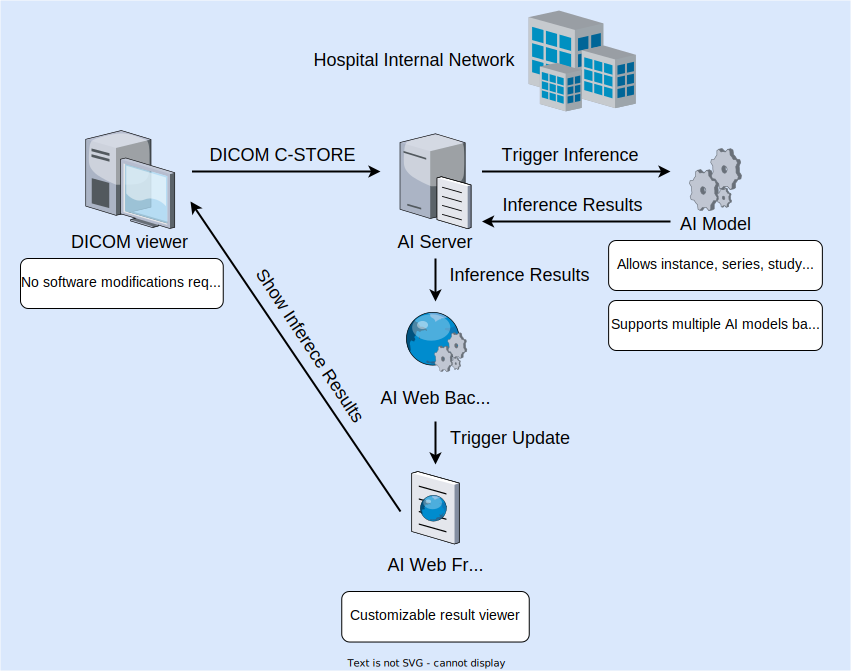
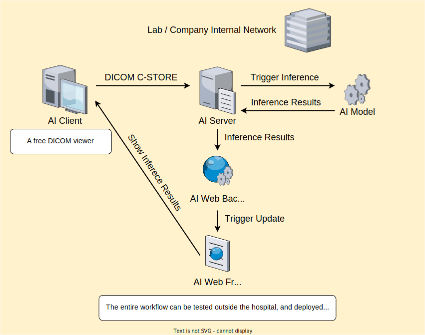

# Medical AI Bridge

A lightweight solution to bridge the gap between DICOM (PACS) server (in the hospital) and a customized AI server.
- Provides a DICOM server & viewer that supports sending, receiving, and viewing DICOM files (for simulating the DICOM server when testing outside the hospital).
- Enables the AI servers to receive images directly through the DICOM protocol (without needing to upload DICOM files through a web interface).
- Supports automatically firing an inference request when the DICOM transfer ends (without requiring to send an additional HTTP request as an inference signal).
- Allows viewing the inference results after firing the request (without pressing F5 to refresh the webpage).
- Includes automated integration tests (with Selenium) to verify the entire inference process (without needing to test manually through GUI).
- Contains detailed document for each component (can modify/replace components easily).




> **Note**:
> We are currently organizing the documentation, tests, and source code before uploading them to GitHub. Meanwhile, if you want to try out the workflow, please [send us an email](mailto:ijsun@vghtpe.gov.tw) describing your use case along with your institution to receive a copy of the source code.

## Introduction

The development of a medical AI project usually consists of two teams: (1) the AI team providing medical inference models (usually led by companies or professors), and (2) the users testing the inference models in hospitals (usually doctors).

In the early stage of development, the AI team usually provides a customized webpage, and simply asks the doctors to send inference requests through several steps:
1. select the DICOM files in the (hospital) DICOM viewer,
2. export the DICOM files to a temporary folder,
3. open the provided webpage in the browser,
4. select the DICOM files from the filesystem & upload them to the AI server, and finally,
5. view the inference results on the webpage.

This workflow has two major issues: (1) the AI team needs to develop a webpage from scratch, and (2) doctors need to repeat the cumbersome process for each inference request.

Our project solves the two issues above, allowing only 3 steps:
1. select the DICOM files in the DICOM viewer,
2. send them to the AI server (through the DICOM protocol, with pre-defined modalities), and
3. view the inference results on our provided webpage.

The AI team can set up this project on their AI servers, and edit the YAML config files to meet their needs. The setup process does not require the knowledge of web development or DICOM protocol.

In the late stage of development, the AI team might want to add some custom features. In such cases, they can modify or replace individual components (written in Python/JavaScript) to fit their needs. Suppose that the feature is commonly needed in the medical AI community, send us a feature request by [opening an issue](https://github.com/j3soon/medical-ai-bridge/issues).

Please note that this project must be run in an internal network, see [the security section](#security) for more information.

> **Sidenotes**:
> - A more ideal workflow is to support viewing the inference results in the DICOM viewer on doctors' computers, eliminating the use of web browsers entirely. However, the format for AI model annotations hasn't been standardized yet. Many DICOM viewers don't support visualizing AI annotations even if we store the inference results as DICOM-RT Structure Set (RTSS), Annotation and Image Markup (AIM), etc. Therefore, using a customizable webpage is more practical.
> - Writing the results back to the hospital's DICOM server is considered too intrusive in the early stage of development. Therefore, we will not implement such a feature.

## Prerequisites

Minimum:
- Linux
- Docker
- Docker Compose

> **Note**:
> - Windows Subsystem Linux (WSL) should suffice but has not been tested yet.
> - Windows isn't supported yet. Although many hospitals use Windows, the AI models often run on a dedicated Linux machine. If you must run your AI models on Windows, please [open an issue](https://github.com/j3soon/medical-ai-bridge/issues) and describe your use case.

Recommended:
- NVIDIA GPU
- NVIDIA GPU Driver
- NVIDIA Docker
- NVIDIA Container Runtime

The recommended prerequisites enable your inference model to access GPU inside a docker container. If your inference model doesn't use GPU, or your inference model isn't dockerized, you may skip these extra installations.

You may install the prerequisites by following the **Docker Containers** section in [this post](https://j3soon.com/cheatsheets/getting-started-with-python/#docker-containers).

Please [open an issue](https://github.com/j3soon/medical-ai-bridge/issues) if you encountered any issue when installing the prerequisites.

## Setup

Clone the project:

```sh
git clone https://github.com/j3soon/medical-ai-bridge
cd medical-ai-bridge
```

Start and stop the services with the following scripts:
```sh
# Start the services
./scripts/docker/compose/up.sh
# Stop the services
./scripts/docker/compose/shutdown.sh
```

You may need to wait for a while when starting the services for the first time. The script will pull and build the required docker images.

To remove the project, simply stop the services and remove the directory. You may also want to selectively remove the docker images to free up space:
```sh
docker images
docker rmi <IMAGE_ID>
```

Next, follow the [User Guide](docs/user-guide.md) to send an inference request and view the results.

## Other Documents

- See [docs/user-guide.md](docs/user-guide.md)
- See [docs/developer-guide.md](docs/developer-guide.md)
- See [docs/contributor-guide.md](docs/contributor-guide.md)
- See [docs/orthanc.md](docs/orthanc.md)
- See [scripts/README.md](scripts/README.md) for scripts that executes commonly-used commands.
- See [tests/README.md](tests/README.md) for selenium tests.

## Security

For the sake of simplicity, this project does not require authentication for most of the components. Therefore, only trusted individuals should be allowed to access the services, and you should not expose the service ports to the public internet.

The provided AI models is only for development purpose, not for diagnostics purpose. A software should be FDA approved/cleared before being used for diagnostics purpose.

## License

`ai-client` and `ai-server` are licensed under the [AGPL-3.0 license](https://www.gnu.org/licenses/agpl-3.0.en.html), which complies with the licenses of Orthanc and Orthanc Python Plugin.

The remainder components are licensed under the [Apache-2.0 license](https://github.com/j3soon/tbparse/blob/master/LICENSE), which is explicitly allowed by [Orthanc's licensing guidelines](https://book.orthanc-server.com/faq/licensing.html#guidelines) to promote commercial usages. More specifically, these components communicates with Orthanc through REST APIs.
> Using a permissive license (MIT, BSD, Apache...) is accepted if the usage of the Orthanc ecosystem falls in: "Calling Orthanc from a third-party system (using REST API or DICOM protocol), even if some AGPL-licensed plugin is installed"
> -- [Orthanc's licensing guidelines](https://book.orthanc-server.com/faq/licensing.html#guidelines)

The project depends on the following third-party software/libraries, which are provided under their own license:
- Orthanc is licensed under the [GPLv3 license](https://hg.orthanc-server.com/orthanc/file/tip/README).
- Orthanc Python Plugin is licensed under the [AGPL license](https://hg.orthanc-server.com/orthanc-python/file/tip/README).

## Use Cases

- AI99 team at Taipei Veterans General Hospital (TVGH)
  > Medical AI Bridge helped integrating several AI models provided by university labs and companies.

Please [open an issue](https://github.com/j3soon/medical-ai-bridge/issues) if you are using Medical AI Bridge and want your institution be listed here.
